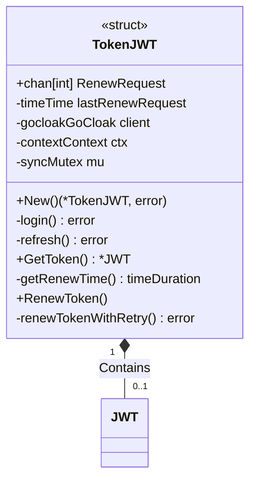
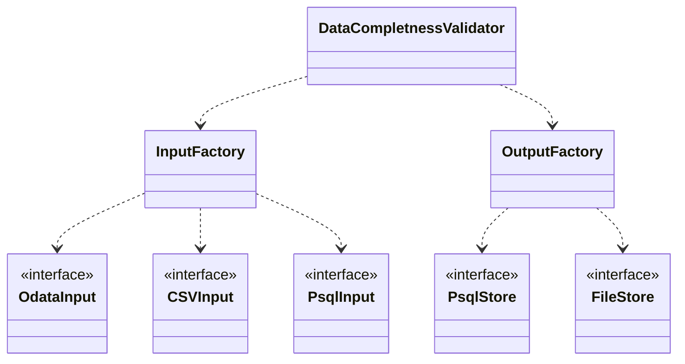
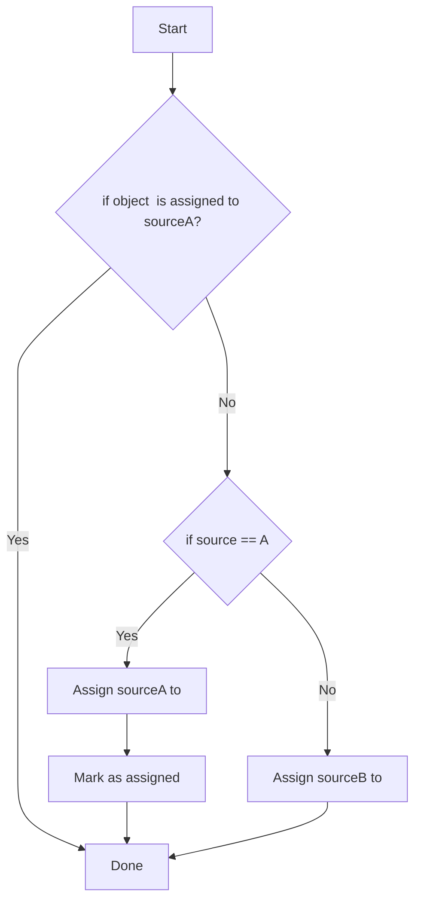

# go-http-poller

## Run app

Export envs
```bash
export CLIENT_ID=xxx
export USERNAME=myemail@example.com
export PASSWORD=strongPassword
export AUTH_URL=https://keycloak.url
export REALM=master
```

```bash
go mod tidy

go run main.go consumer.go producer.go
# or build
go build -o .app
```

## Keycloak module



## Data completness validator

Conception



### Output

Continuous monitoring

Simple solution
* set(SourceA) - set(SourceA)

## Bibliography

Helpful websites used during the work on this project

* <https://github.com/golang-standards/project-layout>
* <https://golang.org/doc/effective_go#names>
* mock http request <https://www.thegreatcodeadventure.com/mocking-http-requests-in-golang/>
* graceful shutdown golang <https://callistaenterprise.se/blogg/teknik/2019/10/05/go-worker-cancellation/>
