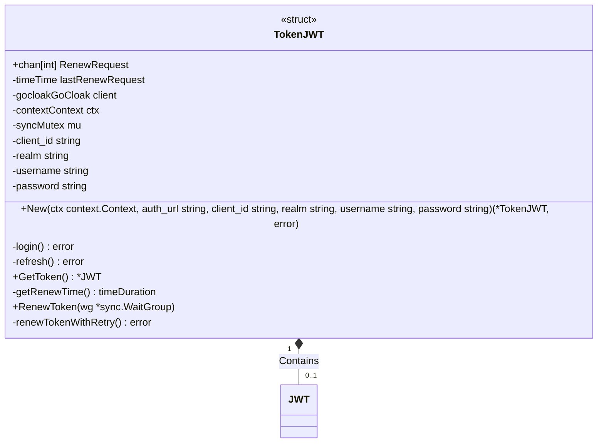
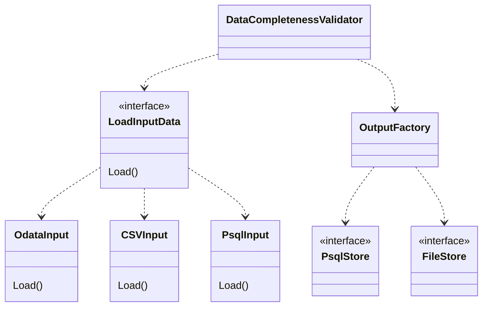
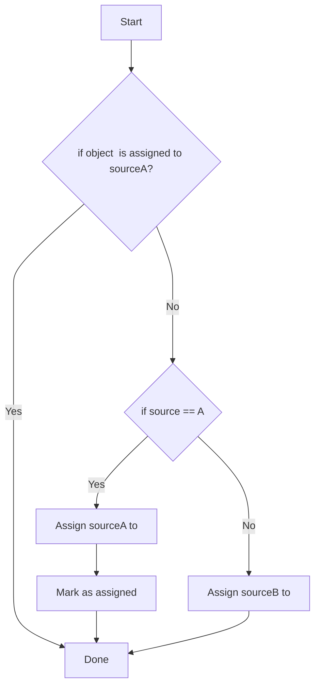

# go-http-poller

## Run app

Export envs
```bash
export CLIENT_ID=xxx
export USERNAME=myemail@example.com
export PASSWORD=strongPassword
export AUTH_URL=https://keycloak.url
export REALM=master
```

```bash
go mod tidy

go run main.go consumer.go producer.go
# or build
go build -o .app
```

## Keycloak module



example usage
```go
func main() {
	// Set up cancellation context and waitgroup
	ctx, cancelFunc := context.WithCancel(context.Background())
	wg := &sync.WaitGroup{}

	token, err := keycloak.New(
		ctx,
		os.Getenv("AUTH_URL"),
		os.Getenv("CLIENT_ID"),
		os.Getenv("REALM"),
		os.Getenv("USERNAME"),
		os.Getenv("PASSWORD"))
	if err != nil {
		panic(err)
	}
	// // Start keycloak token control and Add [workerPoolSize] to WaitGroup
	wg.Add(1)
	go token.RenewToken(wg)

    // Handle sigterm and await termChan signal
	termChan := make(chan os.Signal)
	signal.Notify(termChan, syscall.SIGINT, syscall.SIGTERM)

	<-termChan // Blocks here until interrupted

	// Handle shutdown
	fmt.Println("*********************************\nShutdown signal received\n*********************************")
	cancelFunc() // Signal cancellation to context.Context
	wg.Wait()    // Block here until are workers are done

	fmt.Println("All workers done, shutting down!")
}
```


## Data completeness validator

Conception



### Output

Continuous monitoring

Simple solution
* set(SourceA) - set(SourceA)

## Bibliography

Helpful websites used during the work on this project

* <https://github.com/golang-standards/project-layout>
* <https://golang.org/doc/effective_go#names>
* mock http request <https://www.thegreatcodeadventure.com/mocking-http-requests-in-golang/>
* graceful shutdown golang <https://callistaenterprise.se/blogg/teknik/2019/10/05/go-worker-cancellation/>
* perfect tool for generating struct for json parsing https://mholt.github.io/json-to-go/
